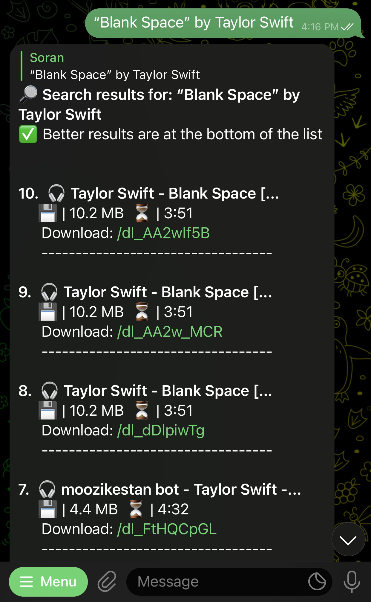
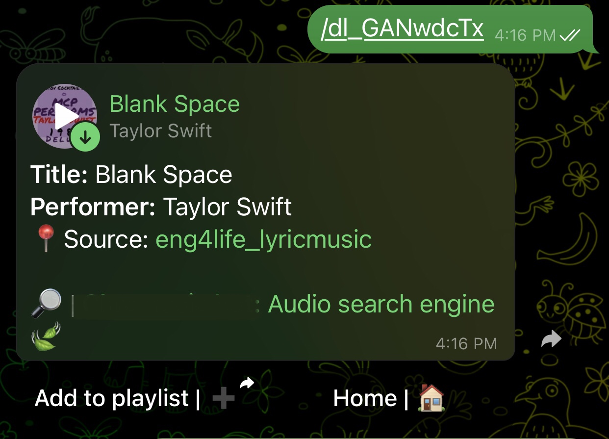
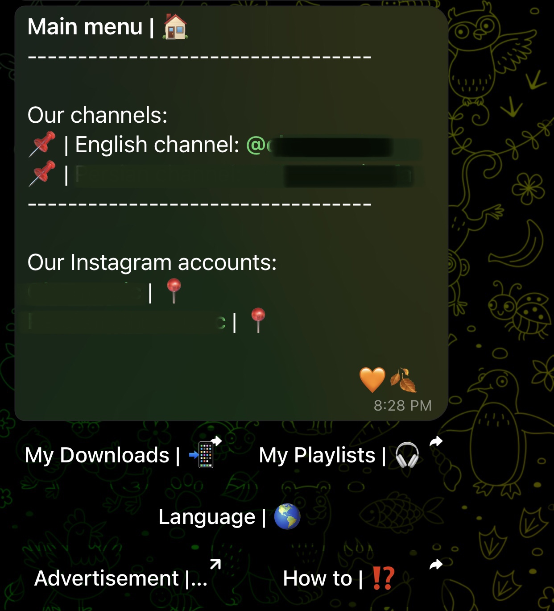
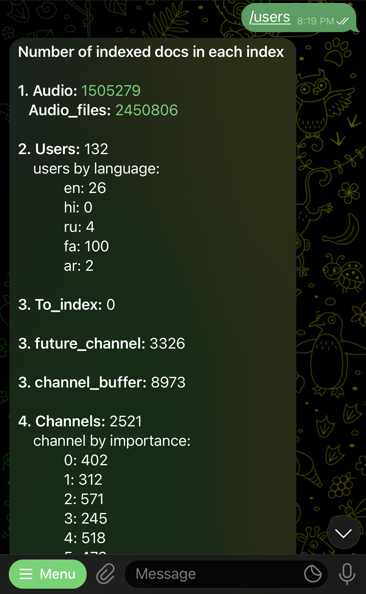

<h1>Telegram audio search engine (TASE)</h1>

A lightening-fast audio search engine on top of the Telegram messenger platform.

This search engine allows users to quickly and easily find information that is of 
genuine interest or value, without the need to wade through numerous 
irrelevant Telegram channels. It provides users with search 
results that lead to relevant information on high-quality websites.

<h2>Features :bulb:</h2>
<ol>
<li><h4>Search engine</h4></li>
<ul>
    <li>Search audio files through the direct bot search</li>
    <li>Search audio files from groups and private chats using @bot_name mention
    and send them directly to the chat</li>
    <li>Real-time search using @bot_name mention, by showing an inline list of results</li>
    <li>Real-time search directly in the private and group chats</li>
    <li>Search based on file-name, performer name, and audio-name</li>
    <li>Shows the top 10 relevant results in a message and up to 50 in the more results returned as inline list</li>
    <li>High accuracy and relevance</li>
    <li>Search in a wide variety of languages</li>
    <li>Show the source-channel name and the link to the file</li>
    <li>Sort results in reverse mode (to make more relevant results in the bottom)</li>
</ul>

<caption align="center">Search example screenshot</caption>

 

<caption align="center">Result audio example screenshot</caption>
 

<li><h4>Indexing features</h4></li>
<ul>
    <li>Automatically finds new channels in an optimistic way
        (first assumes it is a valid channel and validates it later 
        before starting to index) 
        <ol>
        <li>Extract from texts and captions</li>
        <li>Extract from "forwarded mention"</li>
        <li>Extract from links</li>
        </ol>
    </li>
    <li>Automatically indexes new channels</li>
    <li>Iterates through previous channels and resumes indexing from the previous checkpoint</li>
    <li>Analyzes channels and calculates a score (0-5) based on their 
        <ol>
            <li>Density of audio files</li>
            <li>Activity of the channel</li>
            <li>Number of members</li>
        </ol>
    </li>
    <li>Avoids getting banned by the Telegram servers</li>
    <li>Multiple Telegram accounts can be added for indexing purposes</li>
    <li>Hashes the file IDs in a specific way that avoids conflicts to a high degree and still keeps them as short as eight characters</li>    
    <li>Users and channel owners can send request to index a specific channel useing "/index channel_name"</li>    
    <li>Fast indexing</li>

</ul>
 
<li><h4>User limiting/controlling features</h4></li>
<ul>
    <li>Handle user membership in your channel(s) in near real-time</li>
    <li>Set limitations for users based on their membership status</li>
    <li>Limits not-a-member users to search 5 audio files freely, and then they should wait for one minute until they receive their searched audio files</li>
    <li>Not members have limitations with direct in-chat searches</li>
</ul> 
<li><h4>User interface</h4></li>
<ul>
    <li>User guide</li>
    <li>Home button</li>
    <li>A keyboard for each part to ease the process for users</li>
    <li>Multilingual bot (English and Persian are already added)</li>
    <li>Greeting messages to users based on their activity if they haven't been active for more than a week or more than two weeks</li> 
    <li>Shows last 50 users' search history using history button in home keyboard</li>
    <li>Beautiful and vibrant user interface (messages and emojis)</li>
</ul>
<ul><li>
<h5>Playlists</h5><ol>
    <li>Users can have up to 5 playlists and save up to 50 audio files in each of them</li>
    <li>Users can edit playlist meta-data</li>
    <li>Users can edit saved audio files</li>
</ol>
</li></ul>

<caption align="center">Main menu screenshot</caption>
 

<li><h4>Admin features</h4></li>
<ul>
    <li>Admin-specific commands:
    <ol>
    <li>"/users": Generates a summary log of the database status only for the admin/owner of the bot. This is a
         static function and not a formal part of the bot (meant just for simplification; otherwise you can use Kibana).</li>
    <li>"/promote channel_name": promotes the rank of a channel in the indexer waiting list</li>
    <li>"/reset_channel channel_name": Reset the indexing information of a channel in the database</li>
    <li>"/index channel_name": Index a channel immediately without waiting in the indexer queue</li>
    </ol>
    </li>
    <li>On request admin reports using "/users" command (returned as a message): 
    <ol>
    <li>Number of indexed audio files</li> 
    <li>Number of unique users</li> 
    <li>Number of future channels (not yet checked nor indexed</li> 
    <li>Number of buffered channels (reviewed and approved to be indexed)</li> 
    <li>Number of (at least once) indexed channels (counts based on their importance)</li> 
    <li>Number of unique users</li> 
    </ol>
    </li>
    <li>Indexes channels urgently on admin request</li>
    <li>Reset channels' latest index offset on admin request </li>
    <li>Sends runtime exceptions to the admin or to a specific channel or group (based or your provided address)</li>
</ul>

<caption align="center">Admin commands scerenshot</caption> 
<li><h4>Developer features</h4></li>
<ul>
    <li>New languages can be easily added in the language directory</li>
</ul>
<li><h4>Other</h4></li>
<ul>
    <li>Extremely fast</li>
    <li>Documentation is provided in the codes (docstring)</li>
    <li>Handles database related exceptions</li>
    <li>Multi-threaded search (searches multiple requests asynchronously)</li>
    <li>Uses Elasticsearch db (which means you have Kibana automatically)</li>
    * Kibana is a data visualization and exploration tool used for log and time-series analytics, application monitoring, and operational intelligence use cases. It offers powerful and easy-to-use features such as histograms, line graphs, pie charts, heat maps, and built-in geospatial support.
    <li>Handles RTL texts perfectly</li>
</ul>
<ul>   
</ul>
</ol>

<h2>Call for Contributions</h2>

The Telegram audio search engine project welcomes your expertise and enthusiasm!

Ways to contribute to Telegram audio search engine:

<ul>
  <li>Writing code</li>
  <li>Review pull requests</li>
  <li>Develop tutorials, presentations, and other educational materials</li>
  <li>Translate documentation and readme contents</li>
</ul>

  <h2>Issues</h2>
  
If you happened to encounter any issue in the codes, please report it
    <a href="https://github.com/soran-ghaderi/tase/issues">here</a>. 
    A better way is to fork the repository on <b>Github</b> and/or to create a pull request.

<h3>Future work</h3>

- [x] Modulate the functions
- [ ] Make it more dynamic
- [ ] Search based on lyrics
- [ ] Unify and reconstruct the architecture and eliminate redundancy

<h2>If you found it helpful, please give us a :star:</h2>

<h2>License</h3>

Released under the MIT License

<pre>Copyright &copy; 2020-2022</pre>
Soran Ghaderi (soran.gdr.cs@gmail.com)
Personal website: <a href="https://soran-ghaderi.github.io/">soran-ghaderi.github.io</a>
Linkedin: <a href="https://www.linkedin.com/in/soran-ghaderi/">Soran-Ghaderi</a>
Twitter: <a href="https://twitter.com/soranghadri">SoranGhadri</a>

 